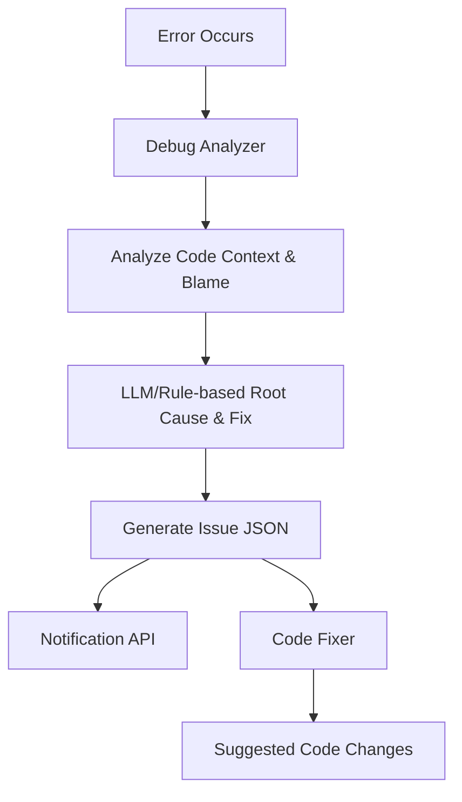

# NoMoreOnCall Architecture

## Overview
NoMoreOnCall is an automated error analysis and code suggestion system. It helps developers quickly identify, analyze, and fix errors in their applications by combining error tracing, code context analysis, and automated code fix suggestions.

## Components

### 1. Debug Analyzer (`debug_analyzer_v2.py`)
- Fetches error details (mock or real API)
- Analyzes code context and blame for error lines
- Uses LLM or rules to generate root cause and fix suggestions
- Outputs a structured JSON issue file
- Sends notifications to the integrated API

### 2. Notification API (Integrated in `demo.py`)
- Receives notifications about analyzed errors
- Logs and acknowledges notifications
- Runs as part of the demo process (no separate server needed)

### 3. Code Fixer (`code_fixer.py`)
- Reads the issue JSON file
- Suggests code changes for a wide range of error types
- Prints suggested code changes and explanations

## System Flow

## Step-by-Step Example
1. **Error Occurs**: An error (e.g., database timeout) is detected.
2. **Debug Analyzer**: Run `python debug_analyzer_v2.py ERR_123` to analyze the error.
3. **Code Context & Blame**: The analyzer finds relevant code, context lines, and blame info.
4. **Root Cause & Fix**: The analyzer (using LLM or rules) determines the root cause and suggests fixes.
5. **Issue JSON**: The results are saved as `issue_ERR_123.json`.
6. **Notification**: The analyzer sends a notification to the integrated API (handled in-process by the demo).
7. **Code Fixer**: Run `python code_fixer.py issue_ERR_123.json` to get code change suggestions.
8. **Suggested Fixes**: The system prints out the original and improved code for each error line.

## Supported Error Types
- DatabaseError, AuthenticationError, ConnectionError, TimeoutError, ValidationError, ResourceNotFoundError, PermissionError, RateLimitError, MemoryError, ConcurrencyError, ConfigurationError, SecurityError, NetworkError, FileSystemError, SerializationError, and generic errors.

## Extending the System
- Add new error types and fix logic in `code_fixer.py`.
- Add new mock error scenarios in the analyzer for testing.

---

For more details, see the README or the code comments in each file. 